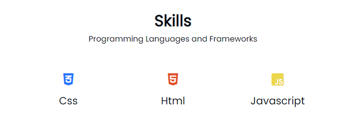
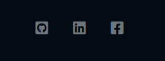

# Portfolio

### made with pure HTML, CSS AND JAVASCRIPT

# So what is this?

An open source portfolio that can be modified through a json file so you can make your portfolio within a few seconds without having to run through the HTML code and manually changing it. All you need is basic knowledge of json and 60 seconds of your time.

# Where is the config file?

The config.json file should be located in the src directory

# Getting started

This example config already has most of what you need so the easiest way of getting started is to just put your github username, a skillset and a bio

Example:

    {
    	"home": {
    		"welcome-message": {

    			"fixed-welcome-message": "I'm a",

    			"animated-welcome-message": [

    			"Web Developer",

    			"UI Designer",

    			"Game Developer"

    			]

    		}

    	},

    	"github": {

    		"github-username": "Your username"

    		},

    	"skills": [

    		"css",

    		"html",

    		"javascript"

    	],

    	"about": {

    		"about-title-description": "The man behind the code",

    		"about-description": "Hi, I'm a software devloper",

    		"about-images": [

    		"./img/about.jpg"

    		]

    	}

    }

# Changing github username

This will let the Portfolio pull your repos and profile picture from github

    //make sure to keep quotations and the commas
    "github": {
     "github-username": "Your username here",
     },

# Filtering repos

By default the portfolio will display all your public repos. You can chose to only display the ones you like by putting the name of the repo in the "github-projects" section

    "github": {

    	"github-username": "Your Username",

    	"github-projects": ["Repo1", "Repo2", "Repo3"]
    },

# Adding a skillset

Most programming languages and framewroks are supported with custom icons and color scheme. You can easily edit the skill set in the "skills" section.

    "skills": [
    	"css",
    	"html",
    	"javascript"
    	],

output:

# Custom name

If you dont want to use your github username then no worries. You can set a custom one easily

Example:

    "profile": {

    	"name": "Your desired name",

    },

# Custom profile picture

You can also chose a custom profile picture same way as you did with the username

Example:

    "profile": {
    	"name": "Your desired name",
    	"profile-picture": "link to your image"
    	// Can either be a local image or a link to an image online
    	}

# Custom wallpaper

If you dont like the way the default background looks you can change it by putting the link to your custom wallpaper in "home-background" in the "home" section

Example:

    "home": {
    		"home-background": "./img/bg.jpg"
    	}

# Setting up social media

You definitly want people to easily be able to contact you and Portfolio makes setting up your social media accounts very easy all you have to do is copy paste the link and voila!

Most popular social media websites are supported.

Example:

    "profile":
    {

    	"name": "Your desired name",
    	"profile-picture": "link to your image"
    	// Can either be a local image or a link to an image online

    	"socials": {

    		"github": "Your github url",

    		"linkedin": "Your linkedin url",

    		"Facebook": "Your Facebook url"
    	}
    }

Output:

# Add email adress

To add your email adress in the social media section, you simply need to prefix your email with "mailto:"

Example:

    "socials": {

    		"github": "Your github url",

    		"Facebook": "Your Facebook url"

    		"mail": "mailto:example@example.com"
    	}

# Changing about section

You can choose to have either text only or text and images in your about section. You can also edit the small subtitle.

Example:

    "about":
    {

    	"about-title-description": "The man behind the code",

    	"about-description": "Hi, I'm a software developer",

    	"about-images": [

    		"Link to image 1",
    		"Link to image 2"
    	]

    }

# Changing the welcome message

The landing has a fixed welcome message and an animated one. Both can easily be changed in home section.

Fixed text is a simple string.
Animated text is an array of strings.

Example:

    "home":
    {
        "welcome-message":
        {

    		"fixed-welcome-message": "I'm a",

    		"animated-welcome-message":
    		[

    			"Web Developer",

    			"UX & UI Designer",

    			"Game Developer"

    		]
    	}

    }
